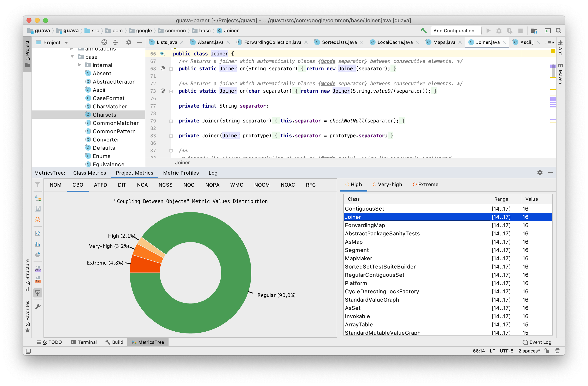
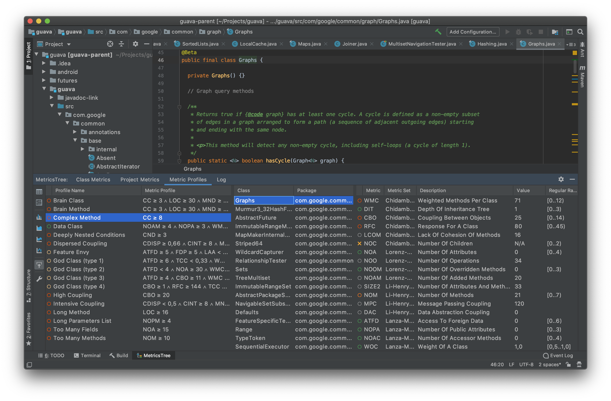

# MetricsTree IntelliJ IDEA plugin 

MetricsTree - это расширение IDE, которое помогает оценить количественные свойства java кода. [???]
Оно поддерживает наиболее распространенные наборы метрик на уровне проекта, пакета, класса и метода.
# Метрики
1. Уровень проекта:
    - Некомментируемые утверждения источника
    - Строки кода
    - Число определенных классов
    - Число абстрактных классов
    - Число статических классов
    - Число интерфейсов
    - Набор метрик MOOD [1]:
        - MHF: Method Hiding Factor(коэффициент сокрытия метода)
        - AHF: Attribute Hiding Factor(коэффициент сокрытия атрибутов)
        - MIF: Method Inheritance Factor(коэффициент наследования методов)
        - AIF: Attribute Inheritance Factor (коэффициент наследования атрибутов)
        - PF: Polymorphism Factor(коэффициент полиморфизма)
        - CF: Coupling Factor(коэффициент связывания)
   - Набор атрибутов качества QMOOD[2]:
        - Reusability (Переиспользование)
        - Flexibility (Гибкость)
        - Understandability (Понятность)
        - Functionality (Функциональность)
        - Extendibility (Расширяемость)
        - Effectiveness (Эффективность)
2. Уровень пакета:
    - Некомментируемые утверждения источника
    - Строки кода
    - Число определенных классов
    - Число абстрактных классов
    - Число статических классов
    - Число интерфейсов
    - Набор метрик Robert C. Martin[3, 4]:
        - Ce: Efferent Coupling(центробежная связь(выносная))
        - Ca: Afferent Coupling(цетростремительная связь)
        - I: Instability(неустойчивость)
        - A: Abstractness(абстрактность)
        - D: Normalized Distance from Main Sequence(нормализованое расстояние от мейн последовательности)
3. Уровень класса:
    - Набор метрик Chidamber-Kemerer[5]:
        - WMC: Weighted methods per class(Утяжеленные методы на класс)
        - DIT: Depth of Inheritance Tree(Глубина дерева наследования)
        - NOC: Number of Children(Число наследников)
        - CBO: Coupling between object classes(связь между объектами классов)
        - RFC: Response for a Class(Ответ для класса)
        - LCOM: Lack of cohesion in methods(Отсуствие согласованности в методах)
    - Набор метрик Lorenz-Kidd[6]:
        - NOA: Number of Attributes(Число атрибутов)
        - NOO: Number of Operations(Число операций)
        - NOAM: Number of Added Methods(Число добавленных методов)
        - NOOM: Number of Overridden Methods(Число переопределенных методов)
    - Набор метрик Li-Henry[7]:
        - SIZE2: Number of Attributes and Methods(Число атрибутов и методов)
        - MPC: Message Passing Coupling(Связь передачи сообщения)
        - DAC: Data Abstraction Coupling(Связь абстракции данных)
        - NOM: Number of Methods(Число методов)
    - Набор метрик Lanza-Marinescu[8]:
        - ATFD: Access To Foreign Data(Доступ к внешним данным)
        - NOPA: Number Of Public Attributes(Число публичных атрибутов)
        - Number Of Accessor Methods(Число доступных методов)
        - WOC: Weight Of A Class(Вес класса)
    - Набор метрик Bieman-Kang[9]:
        - TCC: Tight Class Cohesion(Тесная связанность класса)
    - Набор метрик Chr. Clemens Lee:
            - NCSS: Non-Commenting Source Statements(Некомментируемые утверждения источника)
4. Уровень метода:
    - LOC: Lines Of Code(Строки кода)
    - CC: McCabe Cyclomatic Complexity(Цикломатическая сложность МакКейба)
    - Maximum Nesting Depth(Максимальная глубина вложенности)
    - Loop Nesting Depth(Глубина вложенности цикла)
    - Condition Nesting Depth(Глубина вложенности условия)
    - Number Of Loops(Число Циклов)
    - LAA: Locality Of Attribute Accesses(Локальность доступа к атрибутам)
    - FDP: Foreign Data Providers(Поставщики внешних данных)
    - NOAV: NumberOfAccessedVariables(Число доступных переменных)
    - CINT: Coupling Intensity(Интенсивность связей)
    - CDISP: Coupling Dispersion(Дисперсия связей)
> 1. Brito e Abreu F. and Carapuça R. Object-Oriented Software Engineering: Measuring and controlling the development process, 4th Interntional Conference on Software Quality, Mc Lean, VA, USA, 1994.
> 2. Jagdish Bansiya and Carl G. Davis, A hierarchical model for object-oriented design quality assessment. Software Engineering, IEEE Transactions on, 28(1):4–17, 2002.
> 3. Martin, R. C. OO design quality metrics. An analysis of dependencies. 28 October 1994.
> 4. Martin, R. C. Agile Software Development: Principles, Patterns, and Practices. Alant Apt Series. Prentice Hall, Upper Saddle River, NJ, USA 2002.
> 5. S. R. Chidamber and C. F. Kemerer. A Metrics Suite for Object Oriented Design. In IEEE Transactions on Software Engineering, volume 20 (6), pages 476-493, June 1994.
> 6. M. Lorenz, J. Kidd. Object Oriented Software Metrics, Prentice Hall, NJ, 1994.
> 7. W. Li and S. Henry. Object-oriented metrics that predict maintainability. Journal of Systems and Software, Volume 23, Issue 2, pages 111-122, November 1993.
> 8. M. Lanza, R. Marinescu. Object-Oriented Metrics in Practice. Using Software Metrics to Characterize, Evaluate, and Improve the Design of Object-Oriented Systems. Springer-Verlag Berlin Heidelberg, 2006.
> 9. J. M. Bieman and B. Kang, Cohesion and reuse in an object-oriented system, Proceedings of the 1995 Symposium on Software reusability, Seattle, Washington, United States, pp. 259-262, 1995.
# Featutes   
 - Представление результата расчета метрик в форме дерева или древовидных карт
 - Строит деревья с метриками для класса открытого в редакторе или для всего проекта
 - Поддержка управления расчитанными значениями метрик
 - Нахождение общих антипатернов таких как: 'god class', 'feature envy', 'brain method' и т.д., а так же возможность определения новых
 - Отображение различных характеристик метрики (распределение, корреляция) в диаграммах
 - Показ эволюции значений метрик класса, основанной на 'git log'
 

# Installation
The plugin can be installed from the JetBrains plugin repository within your IDE with 
Preferences | Plugins | Market Place and searching for MetricsTree. 
# Compatibility
The plugin tested for compatibility with IntelliJ IDEA version 2020.3+.
# Development
The plugin is written in Java using IntelliJ's plugin framework.
The code is hosted on GitHub and has a Travis-CI integration for automatic testing.
Compilation is done with Gradle (v 5.2.1+) using the IntelliJ Gradle plugin and should work out of the box.
# License     
The plugin is distributed under Apache License, version 2.0. For full license terms, see [LICENCE](../blob/master/LICENSE).
